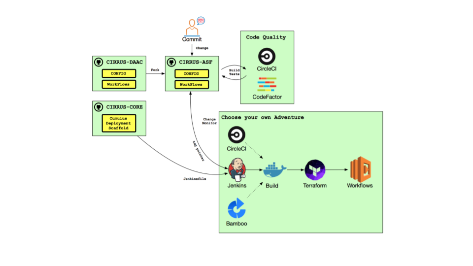

# CIRRUS Core

## Overview

This repository contains the configuration and deployment scripts to
deploy Cumulus Core for a DAAC. All parts of the deployment have been
Terraformed and the configuration minimized by using outputs from
other modules and lookups using Terraform AWS provider data sources.

The project contains a Makefile and CI/CD configuration for Jenkins,
CircleCI, and Bamboo. By configuring a job for one of those CI/CD
providers, CIRRUS core can deploy a DAAC-specific Cumulus
configuration that has been derived from
[CIRRUS-DAAC](https://github.com/asfadmin/CIRRUS-DAAC).

## CIRRUS In Action

See the [Cumulus
Documentation](https://nasa.github.io/cumulus/docs/deployment/deployment-readme)
for detailed information about configuring, deploying, and running
Cumulus.

## Prerequisites

* [Docker](https://www.docker.com/get-started)
* One or more NGAP accounts (sandbox, SIT, ...)
* AWS credentials for those account(s)

## Development Setup

You can run tests and deploy the stack inside of a Docker container:

        $ make image
        $ DAAC_DIR=$HOME/projects/acme-cumulus make container-shell

Here DAAC_DIR is the absolute path to the fork of `CIRRUS-DAAC` that
you would like to deploy.

## Organization

The repository is organized into three Terraform modules:

* `tf`: Creates resources for managing Terraform state
* `data-persistence`: Creates DynamoDB tables and Elasticsearch
  resources necessary for running Cumulus
* `cumulus`: Creates all runtime Cumulus resources that can then be used
  to run ingest workflows.

You won't need to change anything in this project. The Terraform
configuration in these directories remain the same for any Cumulus
deployment.

To deploy your own Cumulus stack, first fork the
[CIRRUS-DAAC](https://github.com/asfadmin/CIRRUS-DAAC/) repository and
rename it for your deployment. For example, you might name it
`ASF-Cumulus`. Next, customize the Terraform and variable settings in
your new `CIRRUS-DAAC`-forked repository. See its
[README](https://github.com/asfadmin/CIRRUS-DAAC/blob/master/README.md)
for more details.

## Deploying Cumulus

You can use CIRRUS-core to deploy multiple Cumulii to one account, and
to multiple accounts. Each instance of a Cumulus deployment is named
by providing a "Deploy Name" and a "Maturity". The Deploy Name is any
string that helps you identify the purpose of the Cumulus stack. The
Maturity is the environment for which it's configured. For example,
you may have an `dev` maturity for your development team's integration
environment.

When choosing values for MATURITY and DEPLOY_NAME:
* The combined length cannot exceed 12 characters
* Must consist of `a-z` (lower case characters), `0-9`, and `-`
  (hyphen) only

The name of the Cumulus stack will be
`DEPLOY_NAME-cumulus-MATURITY`. For example, `asf-cumulus-dev`. By
changing the DEPLOY_NAME you can deploy multiple Cumulus stacks to one
account.

### Deploying from the commandline

0. Create AWS Secret for TEA access with the [named AWS
   Profile](https://docs.aws.amazon.com/cli/latest/userguide/cli-configure-profiles.html)
   that has permissions to deploy to the target NGAP account:

        $ source setup_jwt_cookie.sh <profile-name> <deploy-name> <maturity>

        e.g., to create a secret for XYZ DAAC's NGAP sandbox account with the initials
        of a developer (to make the deployment unique) and a maturity of 'dev':

        $ source setup_jwt_cookie.sh xyz-sandbox-cumulus kb dev

        (This assumes we've setup a named AWS credentials profile with the name `xyz-sandbox-cumulus`)

        **NOTE**: this script is still a WIP and may not work
        in all environments, contributions are welcome!

1. Start the Docker container as shown above (`... make
   container-shell`), providing the `DAAC_DIR` variable you are
   working with.

2. Setup your environment with the [named AWS
   Profile](https://docs.aws.amazon.com/cli/latest/userguide/cli-configure-profiles.html)
   that has permissions to deploy to the target NGAP account:

        $ source env.sh <profile-name> <deploy-name> <maturity>

        e.g., to deploy to the XYZ DAAC's NGAP sandbox account with the initials
        of a developer (to make the deployment unique) and a maturity of 'dev':

        $ source env.sh xyz-sandbox-cumulus kb dev

        (This assumes we've setup a named AWS credentials profile with the name `xyz-sandbox-cumulus`)

4. See the [CIRRUS-DAAC
  README's](https://github.com/asfadmin/CIRRUS-DAAC/blob/master/README.md)
  instructions for creating local secrets files. These will be files
  located in the DAAC directory, and as the note describes below, are
  **NOT** to be checked in to git!

*Important Note*: This is only for local commandline deployment! For
example, deploying from a developer workstation. Normally these
secrets would be provisioned in and provided by a CI/CD service. See
details below on how to do this for Jenkins, CircleCI, and Bamboo. The
secrets files will *not* (and *should not*) be committed to git. The
`.gitignore` file will ignore them by default.

3. Deploy Cumulus. If this is your first Cumulus deployment for this
   stack, deploy the entire Cumulus stack:

        $ make all

   This will deploy the Terraform modules that provision Terraform
   state resources, DAAC-specific resources, the Cumulus
   `data-persistence` module, the `cumulus` module, and `workflows`.

4. Deploy a specific part of the stack: If you're adding a new
   workflow, Lambdas, or other resources for your workflow, and the
   rest of the Cumulus deployment hasn't changed, just deploy the
   workflows:

        $ make workflows

5. Deploying any part of the stack. You can deploy any part of the
   Cumulus stack by running one of the targeted commands:

        $ make tf
        $ make daac
        $ make data-persistence
        $ make cumulus
        $ make workflows

### CI/CD: Jenkins Job

There is a Jenkins pipeline job definition in the `jenkins`
directory. You can configure Jenkins using this file as the source of
the pipeline. By providing the required parameters and provisioning
Jenkins with the secrets, Jenkins will be able to deploy a CIRRUS-DAAC
project to any NGAP account.

### CI/CD: CircleCI

A CircleCI pipeline will be provided in a future version of CIRRUS.

### CI/CD: Bamboo

A NASA Bamboo pipeline will be provided in a future version of CIRRUS.
