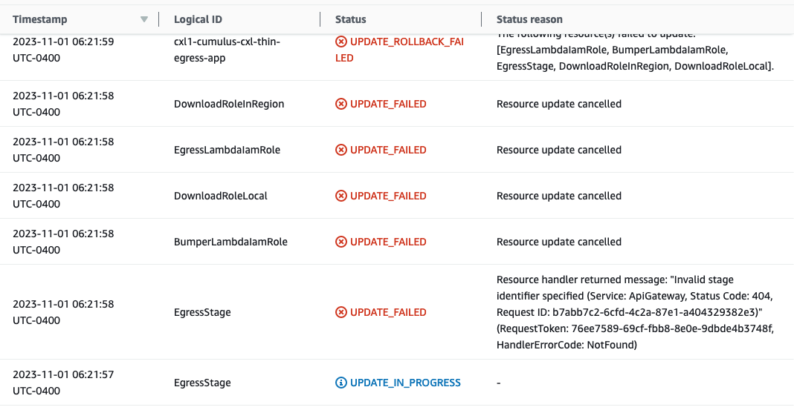
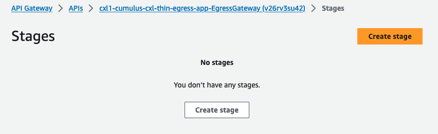
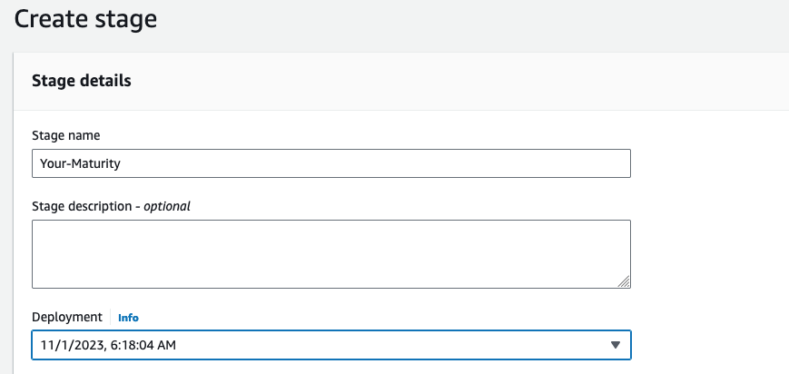
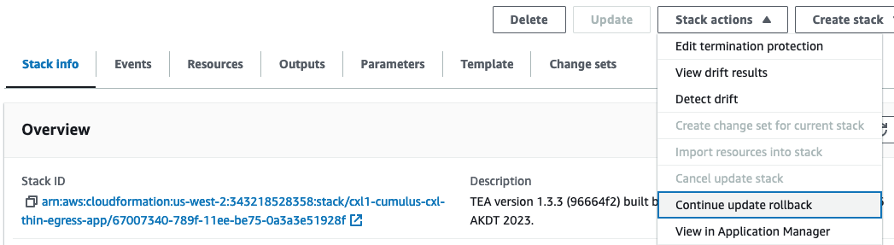
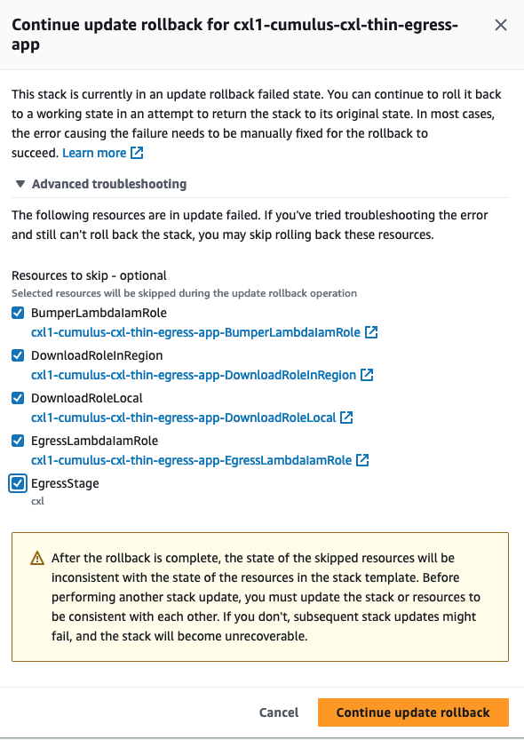
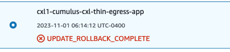

# Resolve TEA CloudFormation Error

In CIRRUS v17.0.0.3 and all later versions the `cumulus/thin-egress.tf` file was updated
to pass Tags to the thin-egress terraform module.  The bulk of the thin-egress application
is deployed via CloudFormation.

For ORNL, the first time the CloudFormation stack tried to apply these tags, it deleted
the TEA Api Gateway stage and generated an error which could not be automatically
recovered.  Maybe other DAAC's will not see this issue but here is what ORNL saw and how
we resolved it.

**It is important to take these steps after the first run of `make cumulus`.  If you
wait until another `make cumulus` run you may put the CloudFormation stack into a state
that cannot be recovered and will instead need to be fully deleted.  Fully deleting the
CloudFormation stack results in the TEA Api Gateway being deleted and will require NGAP
to re-associate CloudFront to the new Api Gateway.**

## Deployment error

When deploying `make cumulus` trying to add tags to TEA you may see an error like this:

```
Error: updating CloudFormation Stack (arn:aws:cloudformation:us-west-2:343218528358:stack/cxl1-cumulus-cxl-thin-egress-app/67007340-789f-11ee-be75-0a3a3e51928f): ValidationError: Stack:arn:aws:cloudformation:us-west-2:343218528358:stack/cxl1-cumulus-cxl-thin-egress-app/67007340-789f-11ee-be75-0a3a3e51928f is in UPDATE_ROLLBACK_FAILED state and can not be updated.
        status code: 400, request id: faaed374-a1ef-43b2-8814-b42c2aeee62f

  with module.thin_egress_app.aws_cloudformation_stack.thin_egress_app,
  on .terraform/modules/thin_egress_app/main.tf line 46, in resource "aws_cloudformation_stack" "thin_egress_app":
  46: resource "aws_cloudformation_stack" "thin_egress_app"
```

## Observing error in AWS Console

If your look at the CloudFormation stack you will see something like this:


And if you click on the stack name and look at the Events tab you will see something
like this:



If you look at the Thin Egress Api Gateway you will see that it no longer has a Stage:



## How to resolve the error

### Add new Api Gateway Stage

First step in resolving the error is to add a Stage to your Api Gateway matching the
`$MATURITY` of your deployment.   Click on `Create Stage`.  In the new window type in
your MATURITY value and select the latest `Deployment` from the dropdown.  All other
values can be left as their default. Like this:



### Rollback Cloudformation using the Advanced option

In the CloudFormation Stack Options select `Continue update rollback`



Select `Advanced troubleshooting` and then select the checkboxes to `skip` all the
resources and then the `Continue update rollback` button.



Your stack should now be in the `UPDATE_ROLLBACK_COMPLETE` state



### Re-run `make Cumulus`

You should now be able to run `make cumulus` successfully

