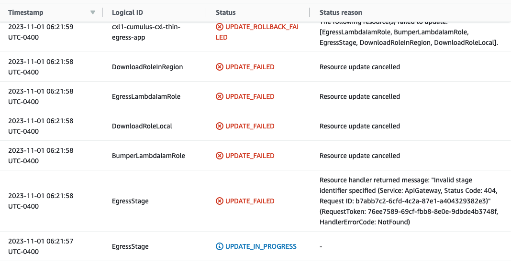
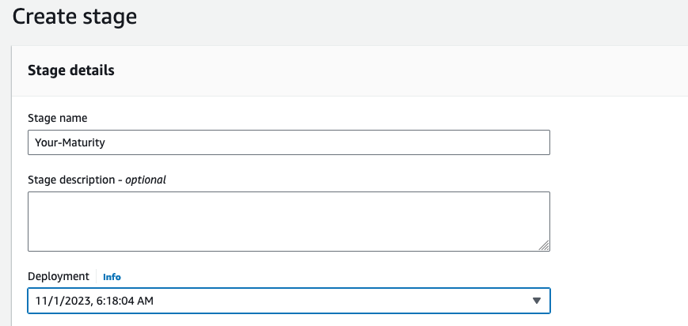
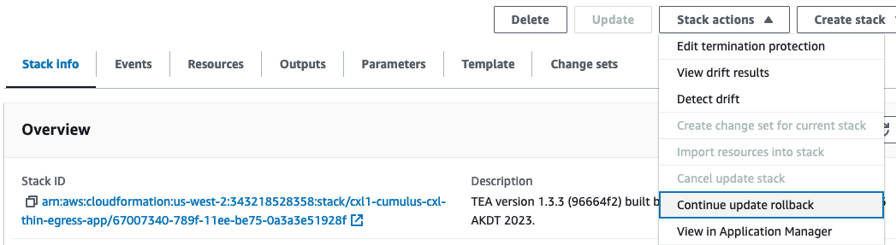
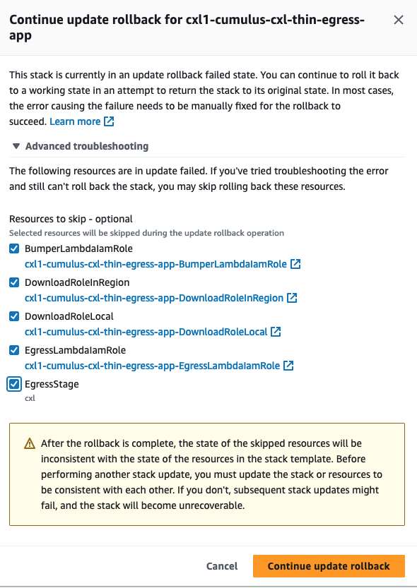

# Resolve TEA CloudFormation Errors

ORNL has run into Cloudformation issues when deploying TEA via CIRRUS.  If your DAAC has
these same issues, here are some instructions that allowed ORNL to recover from this
sitution.  As we identify additional scenarios this document will be updated.

**It is important to take these steps after the first run of `make cumulus`.  If you
wait until another `make cumulus` run you may put the CloudFormation stack into a state
that cannot be recovered and will instead need to be fully deleted.  Fully deleting the
CloudFormation stack results in the TEA Api Gateway being deleted and will require NGAP
to re-associate CloudFront to the new Api Gateway.**

## Deployment error

When deploying `make cumulus` you may see a TEA CloudFormation error like this:

```
Error: updating CloudFormation Stack (arn:aws:cloudformation:us-west-2:343218528358:stack/cxl1-cumulus-cxl-thin-egress-app/67007340-789f-11ee-be75-0a3a3e51928f): ValidationError: Stack:arn:aws:cloudformation:us-west-2:343218528358:stack/cxl1-cumulus-cxl-thin-egress-app/67007340-789f-11ee-be75-0a3a3e51928f is in UPDATE_ROLLBACK_FAILED state and can not be updated.
        status code: 400, request id: faaed374-a1ef-43b2-8814-b42c2aeee62f

  with module.thin_egress_app.aws_cloudformation_stack.thin_egress_app,
  on .terraform/modules/thin_egress_app/main.tf line 46, in resource "aws_cloudformation_stack" "thin_egress_app":
  46: resource "aws_cloudformation_stack" "thin_egress_app"
```

## Observing error in AWS Console

If your look at the CloudFormation stack you will see something like this:


And if you click on the stack name and look at the Events tab you will see a couple of
possible scenarios.  Both have the same root cause `invalid stage identifier` like this:


Above this error you might see a couple scenarios.  `Scenario 1` has update failures
concerning IAM roles like this:



`Scenario 2` mentions failures with lambda functions like this:


The steps to correct the issues vary slightly.

## How to resolve the errors

Both recoveries start by updating your Thin Egress Api Gateway.  You will see that it no
longer has a Stage:


### Add new Api Gateway Stage

Add a Stage to your Api Gateway matching the `$MATURITY` of your deployment.   Click on
`Create Stage`.  In the new window type in your MATURITY value and select the latest
`Deployment` from the dropdown.  All other values can be left as their default. Like
this:



### Rollback Cloudformation using the Advanced option

Both scenarios now require you to roll back the CloudFormation stack so another
`make cumulus` can be run.  The senarios differ in the Advanced troubleshooting options
that should be selected when running the rollback.



### Scenario 1 roll back

In the CloudFormation Stack Options select `Continue update rollback`

Select `Advanced troubleshooting` and then select the checkboxes to `skip` all the
resources and then the `Continue update rollback` button.



Your stack should now be in the `UPDATE_ROLLBACK_COMPLETE` state


### Scenario 2 roll back

In the CloudFormation Stack Options select `Continue update rollback`

Select `Advanced troubleshooting` and then select the checkboxes to `skip` the Lambda
resources only, don't select the `Express Stage` and then the
`Continue update rollback` button.


Your stack should now be in the `UPDATE_ROLLBACK_COMPLETE` state


### Re-run `make Cumulus`

You should now be able to run `make cumulus` successfully

